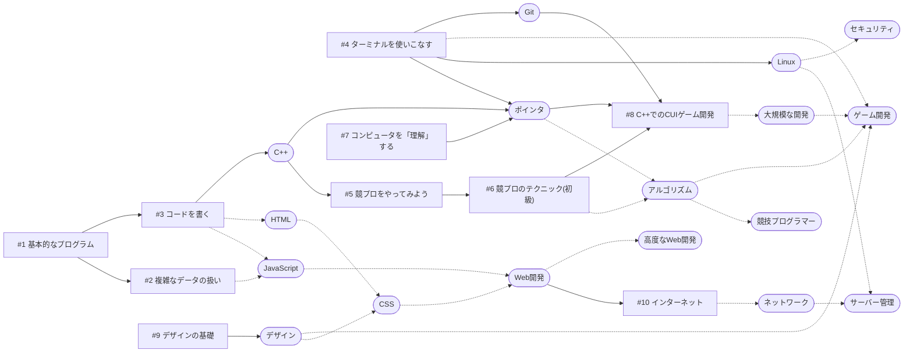

# PC同好会 メンバー用ドキュメント

## はじめに

PC同好会へようこそ!

PC同好会は、105回生の代にできた、パソコンとかプログラミングとかしている団体です。経験者はもちろん、全くの未経験でも大歓迎です。一年中いつでも入ってください!

とりあえず、これまでの主な活動を書いておきます。どんな雰囲気のことしてたのかな、という参考になるかもしれません。

- 第50回音展「船出」(中学)でHP作成(ネットへの公開はなし)・プログラミング関係の模造紙展示
- 第51回音展「道」(中学)でパンフレット・HP・ストリートビュー作成
- 第74回音展「男祭」(高校)でHP作成・サーバー構築
- 2021/12 [スパコン体験塾「富嶽」](https://fugaku100kei.jp/events/20210825/)に参加
- 2022/03 「第24回 全国中学・高校Webデザインコンテスト」で金賞を獲得(全国3~4位相当) ([作品](https://contest.japias.jp/tqj24/240166C/))
- 第75回音展「宴Joy」(高校)でHP・Web掲示板・VRジェットコースター作成
- パソコン甲子園2022モバイル部門でベストデザイン賞・バンタン賞(特別賞)を獲得(全国2~3位相当)

くらいだと思います。(なんかあったら足してください) もし「これ見た!」というものがあったとしたらめちゃくちゃ嬉しいです。

すごいなー、と思われるかもしれませんが、これでも未経験者から始まった同好会です。つまり、今入った皆さんでもできるということです。(多分) 一緒に頑張りましょう!

## 活動について

PC同好会は、基本いつでも活動OKです。週に何回は来てね、とかの制限は(今のところ)ありません。兼部とかも全然OKなので、暇な時に来てください。

活動場所は物理講義室(特別棟4F)、およびDiscord(オンライン)です。 物理室には物理部、あと奇術同好会や天文部などもいるかもしれませんが、まあ仲良くやってください。

## 活動内容について

基本的には、自分の家のPC(できればノート)を学校に持ってきてください。コンセントはあるので、充電があまり持たない機種の場合は電源コードとか持ってきたほうがいいかもです。

ただ、自宅に(自由に使える)PCがないよ、という人もいると思います。同好会として所有しているノートPCを物理室に置いているので、自由に使ってください。(1台しかないので譲り合ってください)

PCを持って帰るのが重い、学校に置いていきたい、という人は、物理部のロッカーを一部貸していただいているので、そこに入れてください。(鍵の場所は部長に聞いてください)

残念ながら学校のネットワークを使うことはできないので、各個人のスマホからテザリング(インターネット共有とも)をして、「インターネット→スマホ→PC」という形で接続してもらうことになります。
スマホの通信量を使うことになるし、立地の問題で回線が速いわけではないため、大容量のダウンロードは家で済ませてくると良いです。
どうしても通信量が足りない、という人は、周りの余裕がある人や無制限の人に頼んで回線を貸してもらってください。

内容は特に制限はありません。ただ、一応PC同好会なので、原則PCに関係することにしてください。あと、PCゲームはやめてください。

## プログラミングの勉強について

プログラミングあんまりやったことない人は、「何してもいいって言われても...」という感じだと思います。なので、とりあえずプログラミングを習得してみましょう。

もし何かやりたいことがある場合、(どれだけ無謀なことでもいいので)Discordなどで相談してみてください。何から始めればいいかアドバイスできると思います。
(例えば、「ゲーム制作」「Web開発」「スマホの改造」「ゲームのサーバー構築」「競技プログラミング」「資格取得」など)

特にやりたいことはないなあ、まずはプログラミングできるようになろうかな、という人も多いと思うので、そういう人向けに資料を作っています。まだ最初の方しかできていませんが、まずは読んでみてください。

1. [基本的なプログラム](https://www.docswell.com/s/ZOI_dayo/ZENXWG-Programming-01)
2. [複雑なデータの扱い](https://www.docswell.com/s/ZOI_dayo/ZYWD73-Programming-02)
3. [コードを書く](https://www.docswell.com/s/ZOI_dayo/5NR1NW-Programming-03)
4. [ターミナルを使いこなす](https://www.docswell.com/s/ZOI_dayo/Z6YVLW-Programming-04)
5. [競プロをやってみよう](https://www.docswell.com/s/ZOI_dayo/ZVV18Q-Programming-05)
6. [競プロのテクニック(初級)](https://www.docswell.com/s/ZOI_dayo/Z1JRMV-Programming-06)
7. [コンピュータを「理解」する](https://www.docswell.com/s/ZOI_dayo/KYWD69-Programming-07)
8. [C++でのCUIゲーム開発](https://www.docswell.com/s/ZOI_dayo/ZLL1WQ-Programming-08) 
9. [デザインの基礎](https://www.docswell.com/s/ZOI_dayo/KENXPR-Programming-09)
10. [インターネット](https://www.docswell.com/s/ZOI_dayo/ZM1L68-Programming-10)
11. (製作中)

技術ツリー的なやつはこんな感じだと思います(A→BはBをやるためにAが必要なことを、また実線はスライドで習得できそうなところを表しています。また、四角は説明スライド(上記)、角丸四角形は分野です)

空いてるところはちょっとずつ作っていきます。もちろん、全分野やるのは難しいので、おもしろうそうなところからやってみましょう!

また、Discordで気軽に質問することをお勧めします。社会人になったらプログラミングの質問をするだけでスクールにお金がかかるらしいので、無料で質問できる今のうちに使いまくってください!

## 文化祭での活動

基本的に活動の制限はないのですが、同好会という存在が基本音展のために存在することもあり、「音展HPの作成」という業務は毎年あると思います。
僕の経験上、まず間に合わないので、できれば夏休みに入ったくらいから作り始めましょう。でなければ、当日の深夜4時くらいまでWebページを作るハメになります。(経験談)

また、サーバーの管理も同好会でやっています。引き継ぎ人員がいるか怪しいので、ネットワークとかサーバーとかハッキングとかに興味ある人がいればぜひお願いします。

## ネタ切れの時は

また、いくら自由に活動していいと言っても、すぐにネタ切れになる可能性が高いです。なので、数人でグループを作ってコンテストなどに出てみてもいいかもしれません。

有名なコンテストは例えば、

- 情報オリンピック(競技プログラミング)
- パソコン甲子園(競技プログラミング、またはスマホアプリ制作、またはデジタル絵)
- アプリ甲子園(スマホアプリ制作)
- 未踏ジュニア(工作からPC/スマホアプリまでなんでもOK)

とかですかね?

また、資格を取ってみるというのも役に立つと思います。

有名なものであれば、

- ITパスポート
- 基本情報技術者試験
- 応用情報技術者試験
- ウェブデザイン技能検定
- G検定(AI系)

とかですかね?

他には、競技プログラミングをやってみるというのもありです。ハマればしばらくはネタ切れしないでしょう。

競技プログラミングというのは、問題が与えられるので、それを解くコードを書いて提出するというものです。AtCoderというサイトがあるので、興味が少しでもあればアカウントを作ってみてください。

## その他

Twitterアカウントは、部員なら一応誰でも投稿していいということになっています。何か作ったので宣伝したい、というのもOKです。ただ、一応団体公式なので、それを踏まえた投稿にしていただけるとありがたいです。
この辺りの話は、Discordの「共有財産/公式アカウント」あたりのチャンネルを見てください。

## 終わりに

とりあえず以上です。皆さんがプログラミングを楽しんでくれることを願っています。

